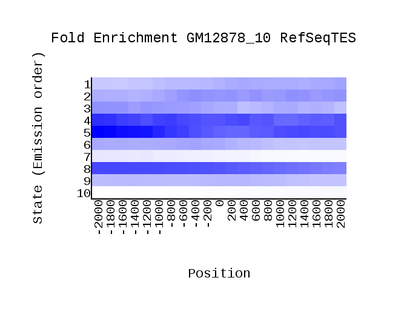
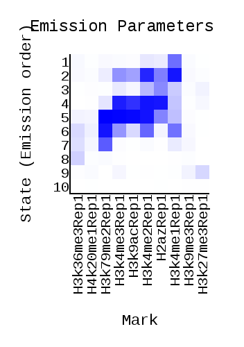
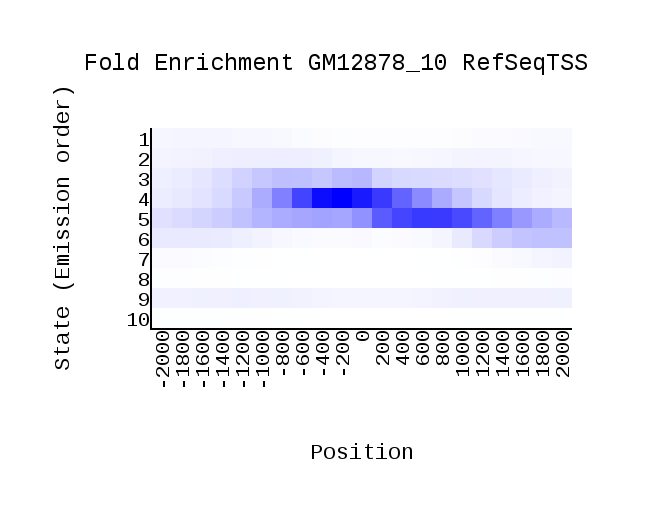
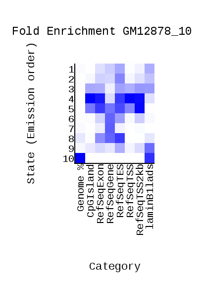
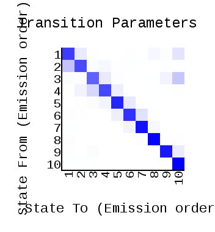
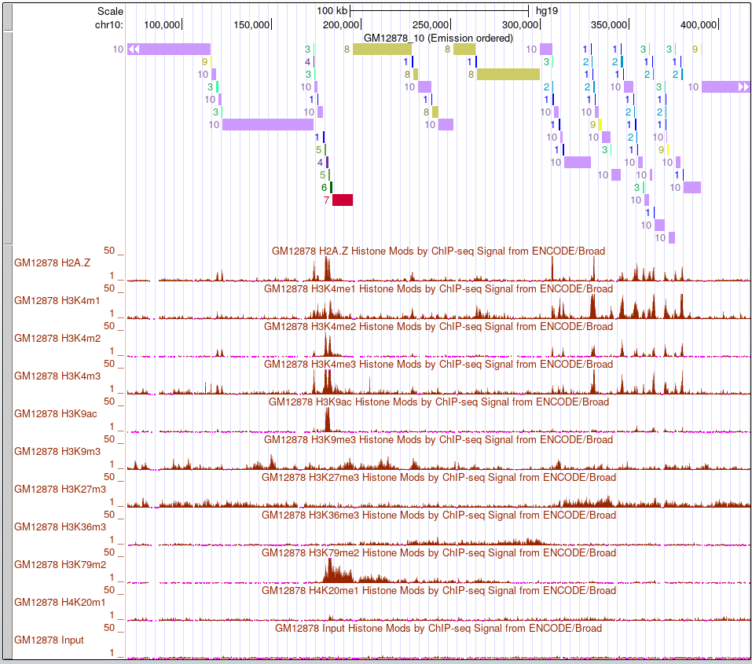
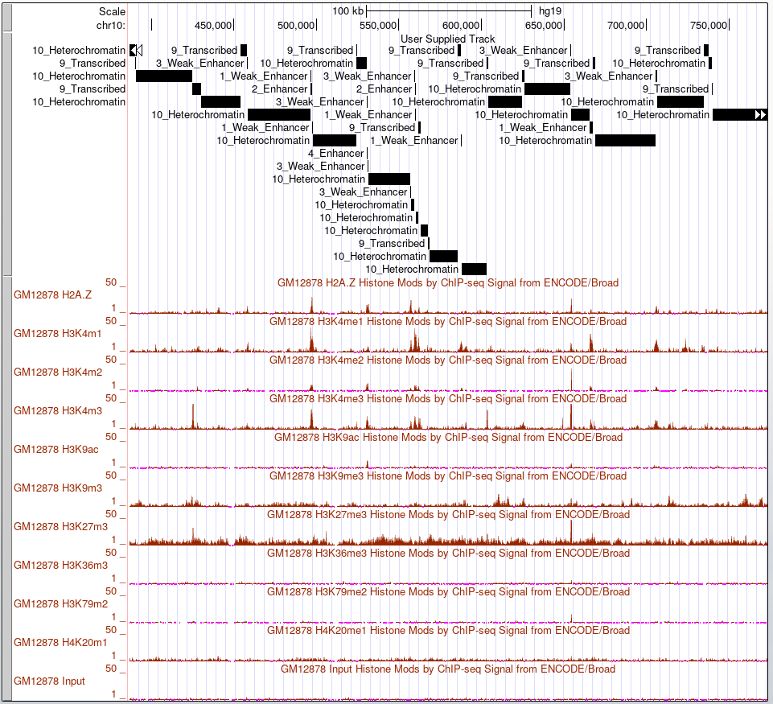

# hse_hw3_chromhmm

[Colab](https://colab.research.google.com/drive/17eIdYztRHqIZ8TF9Sz-79bMxPcnkdFBi?usp=sharing)

# Основная часть

Клеточная линия, рассматриваемая в Дз2 (GM12878), содержит ChIP-seq эксперименты в рассматриваемых гистоновых метках, поэтоому для данного дз была выбрана именно она GM12878.

## Список гистоновых меток

| Гистоновая метка | Название | Ссылка |
|------------------|--------|--------|
|H3K9me3|H3k9me3Rep1.bam|http://hgdownload.cse.ucsc.edu/goldenPath/hg19/encodeDCC/wgEncodeBroadHistone/wgEncodeBroadHistoneGm12878H3k9me3StdAlnRep1.bam|
|H3K9ac|H3k9acRep1.bam|http://hgdownload.cse.ucsc.edu/goldenPath/hg19/encodeDCC/wgEncodeBroadHistone/wgEncodeBroadHistoneGm12878H3k9acStdAlnRep1.bam|
|H3K36me3|H3k36me3Rep1.bam|http://hgdownload.cse.ucsc.edu/goldenPath/hg19/encodeDCC/wgEncodeBroadHistone/wgEncodeBroadHistoneGm12878H3k36me3StdAlnRep1.bam|
|H2AZ|H2azRep1.bam|http://hgdownload.cse.ucsc.edu/goldenPath/hg19/encodeDCC/wgEncodeBroadHistone/wgEncodeBroadHistoneGm12878H2azStdAlnRep1.bam|
|H4K20me1|H4k20me1Rep1.bam|http://hgdownload.cse.ucsc.edu/goldenPath/hg19/encodeDCC/wgEncodeBroadHistone/wgEncodeBroadHistoneGm12878H4k20me1StdAlnRep1.bam|
|H3K79me2|H3k79me2Rep1.bam|http://hgdownload.cse.ucsc.edu/goldenPath/hg19/encodeDCC/wgEncodeBroadHistone/wgEncodeBroadHistoneGm12878H3k79me2StdAlnRep1.bam|
|H3K27me3|H3k27me3Rep1.bam|http://hgdownload.cse.ucsc.edu/goldenPath/hg19/encodeDCC/wgEncodeBroadHistone/wgEncodeBroadHistoneGm12878H3k27me3StdAlnRep1.bam|
|H3K4me2|H3k4me2Rep1.bam|http://hgdownload.cse.ucsc.edu/goldenPath/hg19/encodeDCC/wgEncodeBroadHistone/wgEncodeBroadHistoneGm12878H3k4me2StdAlnRep1.bam|
|H3K4me3|H3k4me3Rep1.bam|http://hgdownload.cse.ucsc.edu/goldenPath/hg19/encodeDCC/wgEncodeBroadHistone/wgEncodeBroadHistoneGm12878H3k4me3StdAlnRep1.bam|
|H3K4me1|H3k4me1Rep1.bam|http://hgdownload.cse.ucsc.edu/goldenPath/hg19/encodeDCC/wgEncodeBroadHistone/wgEncodeBroadHistoneGm12878H3k4me1StdAlnRep1.bam|

## cellmarkfiletable.txt

[Файл cellmarkfiletable](./cellmarkfiletable.txt)

## ChromHMM
[Папка с ChromHMM](./ChromHMM/)

|   |   |
|---|---|
|||
|||
||   |

## Данные из геномного браузера

## Эпигенетические типы

|State|Эпигенетический тип|Встречаемость в гистоновых модификациях|Описание|
|-|--------|------|----------|
|1|Weak Enhancer|H3K4me1, немного H2AZ |RefSeqGene|
|2|Enhancer|Сильнее всего в H3K4me1 и H3K4me2, немного в H3K4me3, H2AZ и H3K9ac|Во всех, но наиболее RefSeqTES|
|3|Weak Enhancer|H2AZ, H3K4me1, H3K4me3, меньше в H3K4me2|Во всех, кроме RefSeqGene|
|4|Enhancer|Чаще в H3K4me3, H3K4me2, H2AZ и H3K9ac|CpGIsland, RefSeqExon, RefSeqTSS, RefSeqTSS2kb|
|5|Active Promoter|Чаще в H3K4me3, H3K4me2, H3K79me2 и H3K9ac|LaminB1lads, RefSeqTES, RefSeqTSS2kb|
|6|Strong Enchancer|Чаще в H3K79me2, H2AZ, меньше в H3K4me1, H3K4me2, H3K4me3|RefSeqGene, меньше RefSeqTES, RefSeqTSS2kb|
|7|Transcriptional elongation|H3K79me2, H2AZ, в остальных поменьше|RefSeqGene, RefSeqTES, laminB1lands, RefSeqExon|
|8|Weak transcribed|H3K36me3 и H2AZ| RefSeqGene, RefSeqTES, RefSeqExon|
|9|Transcribed|H3k27me3, H3K4me3, H3k9me3|Все|
|10|Heterochromatin|Только в H3k27me3|Только LaminB1lads и Genome| 

## Бонус
Можно заменить числа стейта на эпигенетический тип

